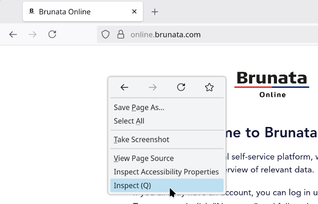
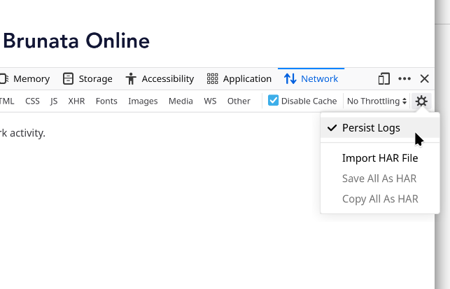
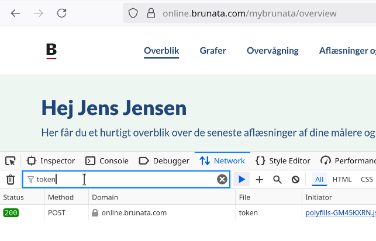
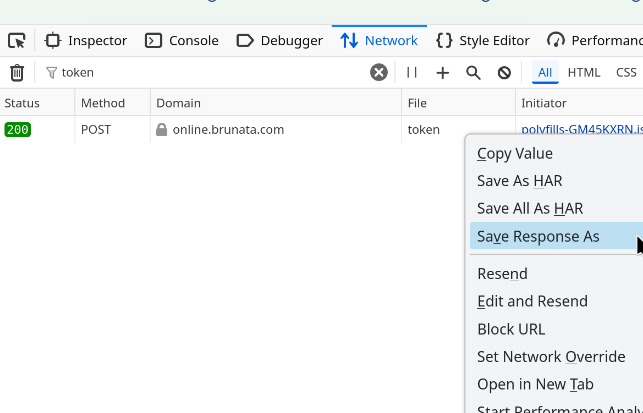

Getting started
===============

This package can be used for interfacing with the API behind `Brunata Online <https://online.brunata.com>`__

`brunata_online` does not contain a mechanism for initially authenticating the user, though it can refresh the token,
you are required to extract a token from your browser as the initial authorization.

Token
-----

To obtain the token, you can use the »Inspect« tool in your browser (Firefox in this example).

1. Go to the signin page (https://online.brunata.com) and before logging in, open the Inspect tool by right-clicking anywhere on the page.

2. In the inspect tool, select the Network tab and make sure that "Persist Logs" are enabled

3. Proceed to login on the webpage, while keeping the Inspect-tool open.

4. After login is complete, the Network-tab in Inspect-tool should show a long list of requests that have been made.
   One of these should contain an API token. Use the Filter URLs to find the right contents

5. When the right request is located, saving the response (containing the token) can be done by right-clicking

Usage example
-------------

.. literalinclude:: ../../src/demo.py

.. toctree::
   :maxdepth: 5
   :caption: Contents:

   self
   brunata_online

